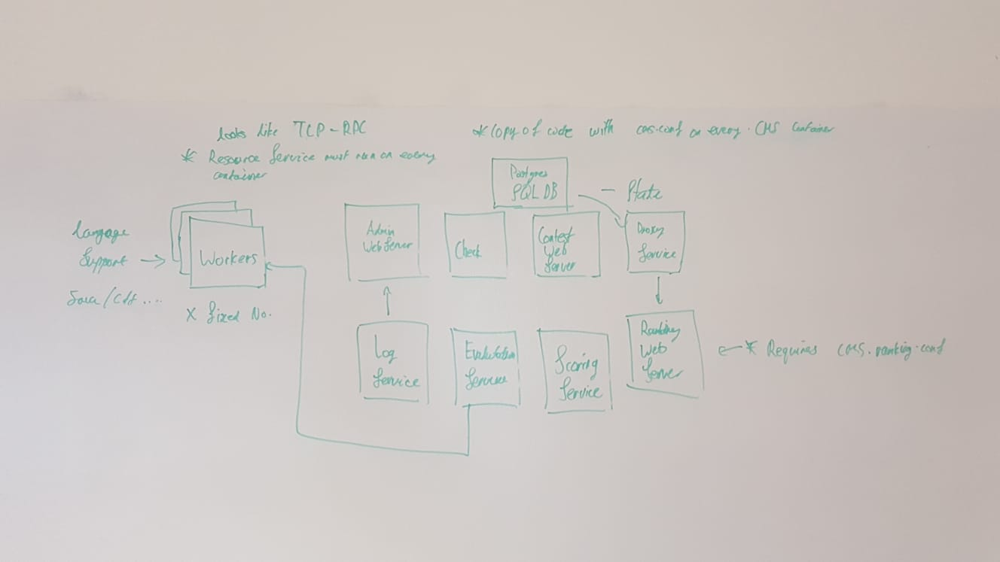

# K8s Contest Managment System
Make deploying [CMS](https://github.com/cms-dev/cms) great again.

## Intro
The Contest Managment System (CMS) is a great open source platform to host programming contests. 
However deploying it is also really hard.

By adapting CMS to be deployed using `kubernetes`, k8s-cms can make deploying 
CMS simple as:
```
kubectl apply -f https://raw.github.com.... TODO
```

## Setup
### Contributing

1. Resolve submodules after cloning;
```sh
git submodule update --init --recursive
```
2. Fill `env` file with secrets
```sh
cp env .env
nano .env # use your favourite editor
```
3. Run the stack
```sh
docker-compose up
```

## Design


Containers:
- Database - Deploy using Postgres SQL container `cms-db`
- CMS - all services derive from base container `cms-base`
    - ResourceService - `cms-resource`
    - LogService - `cms-log`
    - EvaluationService - `cms-evaluation`
    - ScoringService - `cms-scoring`
    - ProxyService - `cms-proxy`
    - PrintingService - `cms-printing`
    - AdminWebServer - `cms-web-admin`
    - RankingWebServer - `cms-web-ranking`
    - Checker - `cms-checker`
    - ContestWebServer - `cms-web-contest`
    - Worker - `cms-worker` requires language support

> `cms-base` contains python runtime, copy of cms source code and `cms.conf`
>  and is used a a base to build the other services

### Security
Secrets are injected into the containers as environment variables via `.env` file.

### Limitations
What does not work:
- multiple contests - only supports running one contest at a time

## Roadmap

### Version 0.1 alpha
- dockerizing all these:
    - Database  :heavy_check_mark:
    - ResourceService :heavy_check_mark:
    - LogService :heavy_check_mark:
    - ScoringService :heavy_check_mark:
    - ProxyService - with single contest support limitation :heavy_check_mark:
    - EvaluationService :heavy_check_mark:
    - PrintingService :heavy_check_mark:
    - AdminWebServer :heavy_check_mark:
    - RankingWebServer :heavy_check_mark:
    - Checker :heavy_check_mark:
    - ContestWebServer 
    - Worker - requires language support
        - C C++ Java Pascal Python with zip executable PHP Rust C# 
- write k8s deployment YAMLs all these:
    - Database
    - ResourceService
    - LogService
    - ScoringService
    - EvaluationService 
    - ProxyService
    - PrintingService
    - AdminWebServer
    - RankingWebServer
    - Checker
    - ContestWebServer
    - Worker - requires language support
        - C C++ Java Pascal Python with zip executable PHP Rust C# 
- figure out contest & deployment

### Version 0.2 alpha
- making k8s-cms scalable:
    - scaling `Workers` to cater to more participants.
        - regenerate `cms.conf` using kubernetes deployment/docker-compose file.
        - restart `Checker` and `EvaluationService` to load rescaled workers
    - scaling `ContestWebServer` to cater to more participants
- securing k8s-cms:
    - data storage encryption
    - k8s communication encryption.
    - HTTPs for RankingWebServer,AdminWebServer,ContestWebServer.
- multiple contests support
    - contests can be obtained from DB via `get_contest_list()`
    - make `cms-proxy` run without an active contest
    - spawn multiple `cms-proxy` to serve multiple contests
